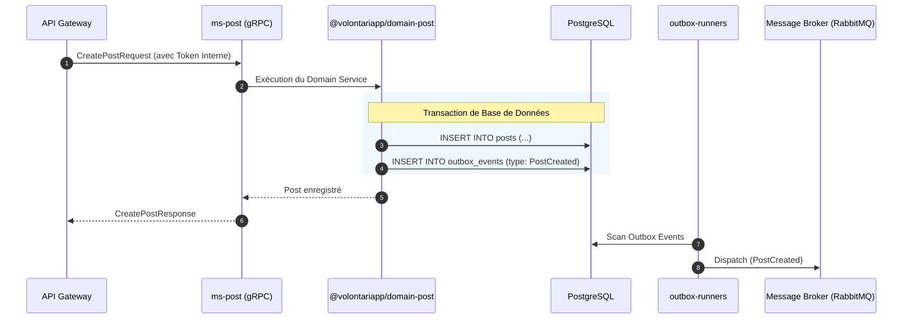

# Architecture & Design Document (ms-post & domain-post)

## Architecture Overview

Le microservice `ms-post` applique strictement le patron **Domain-Driven Design (DDD)** allié à l'**Event-Driven Architecture**.
Conçu comme une couche de présentation réseau (gRPC), il délègue l'intégralité de la complexité métier et de l'accès aux données (PostgreSQL via TypeORM) au paquet distribué `@volontariapp/domain-post`.

## Directory Structure

### 1. Structure du Microservice (`ms-post`)

```text
ms-post/
├── src/
│   ├── config/          # Configurations gRPC, TypeORM
│   ├── grpc/            # Contrôleurs RPC interfaçant proto-registry avec le domaine
│   ├── modules/         # Faisceau d'injection de dépendances (NestJS)
│   └── main.ts          # Bootstrap de l'application
```

### 2. Structure du Domaine Partagé (`domain-post`)

```text
npm-packages/packages/domain-post/
├── src/
│   ├── entities/        # Modèles de base de données (Post, Comment)
│   ├── value-objects/   # Objets immuables de validation
│   ├── repositories/    # Interfaces DAO TypeORM
│   └── services/        # Services métiers (ex: PostService)
```

## Data Flow & Component Communication



## Design Decisions & Trade-offs

1. **Isolation du Domaine (`domain-post`)** : L'extraction de la logique métier permet son importation par des workers en arrière-plan (ex: `post-processor-post`), évitant la duplication de logique métier ou d'appels RPC redondants.
2. **Cohérence par Outbox Pattern** : L'utilisation de transactions de base de données pour écrire simultanément la donnée métier et l'événement permet d'éviter l'usage de transactions distribuées coûteuses.
3. **Sécurité Déléguée** : Fait confiance au token interne transmis par l'API Gateway, évitant de réimplémenter la validation OAuth2 ou RBAC au niveau du microservice individuel.
